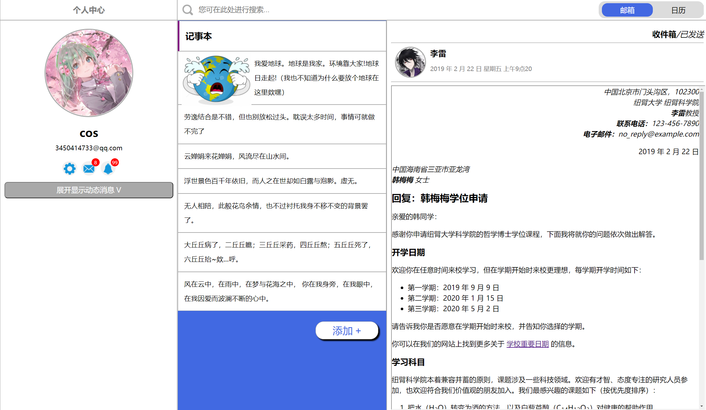
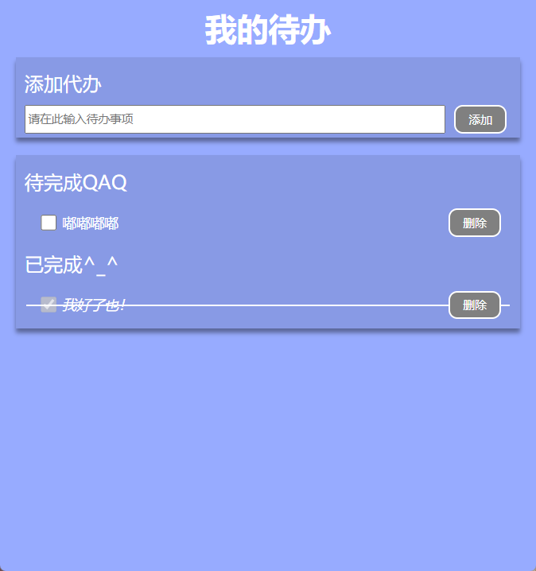
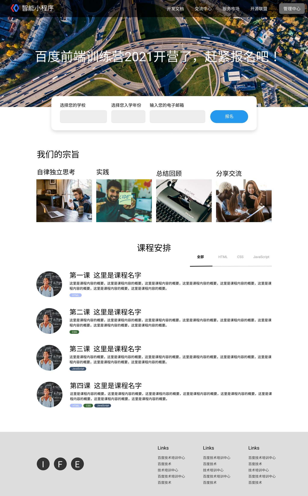

# 搭建博客的原因
- 自大二开始，就有用博客记录学习成长的想法，一开始只是单纯的在CSDN上发一些数据结构练习，学习等博客，后来涉猎的知识也开始多了起来，主要还是以笔记为主23333也方便自己的复习
- 尝试用了gitpage + hexo搭建这个博客，行！而且这个博客可以在github上实时同步
    - 搭建步骤参考此博客：[Hexo + GitPage 搭建个人博客](https://www.jianshu.com/p/d9dff0bf5da5)
    - 主要是习惯用md语法了，wordpress功能太多不适合，而且hexo也能自己定制主题练练手~
    - 关于我真的真的是个菜鸡这件事qwq

# 现在正在进行的是？
- 2022/5/6 一眼看到shoka这个主题就爱上了，开冲！立马更换成了这个主题。
- 2022/3/20 找暑期实习真难哇！！也有在刷题惹
- 2022/3/1 百度进阶班项目临近结束，准备冲刺春招暑期实习~
- 2022/2/9 于是乎，今天搭了这个博客（经常忘记要干啥x）
- 2022/1/17 大作业还不容易23333不过做完还是很有成就感
- 2022/1/14 学前端走火入魔ing
- 2022/1/8 寒假了，在家了，开始摸鱼
- 2021/12/25 一周三个课设，实在顶不住了（在做了，在做了，咕——） 

# 喜欢什么？
喜欢吃好吃的。
c++天下第一！（？）
会进行一些前端的学习……

# 前端学习成果汇总

## 百度前端训练营作业
不用任何框架，原生实现：
- homewok1-1 [Hello World](https://ysx.cosine.ren/project/homework-day1/html/hello.html)
- homewok1-附加题 简历 [My Resume](https://ysx.cosine.ren/project/homework-day1/html/resume.html)
- homework2-1 信件标记 [纽臂大学李雷来信](https://ysx.cosine.ren/project/homework-day2/src/1_letter/letter.html)
- homework2-2 加载小动画 [css加载动画](https://ysx.cosine.ren/project/homework-day2/src/2_loading/loading.html)
- homework2-3 flex实现垂直水平居中 [方块垂直水平居中](https://ysx.cosine.ren/project/homework-day2/src/3_flex/flex.html)
- homework2-4 定位实现垂直水平居中 [方块垂直水平居中-定位实现](https://ysx.cosine.ren/project/homework-day2/src/4_position/position.html)
- homework2-5 简单的响应式demo 响应式demo：[随屏幕大小变化方块的颜色](https://ysx.cosine.ren/project/homework-day2/src/5_ResponseDemo/demo.html)
- homework2-6 附加题 [布局练习](https://ysx.cosine.ren/project/homework-day2/src/6_附加题/demo.html)
- homwork3  1-4  文件树转html/字符串、深拷贝、数字时钟 [js练习](https://ysx.cosine.ren/project/homework-day3/index.html)
- homwork3  选做题 todolist [todolist(by cos)](https://ysx.cosine.ren/project/homework-day3/todolist.html)
- homwork4  添加/上传表单数据  [HomeWork_Day4](https://ysx.cosine.ren/project/homework-day4/index.html)
- 结课作业 暂不要求手机端适配  [结课作业](https://ysx.cosine.ren/project/class-ending-homework/)
    - step1：完成静态页面的布局及样式开发
    - step2：实现报名区域、课程安排的筛选功能
    - step3：实现点击弹出年份选择面板，并增加弹出框和课程的渐进动画
    - step4：实现选择学校面板，左侧选中某个省市时，右侧的院校List会联动发生改变，只显示该省市下的院校。省市保证至少10个，至少有1个省市包含的院校超过20个。
    - step5：实现报名提交的验证与提示，报名成功后的重新报名选项！完成！
    - 实现组件封装，将Picker和Prompt封装为新的组件
    - github地址：[class-ending-homework](https://github.com/yusixian/class-ending-homework)
比较有意思的有：布局练习、homework3的todolist、结课作业
### 布局练习
- 在线预览链接：https://ysx.cosine.ren/project/homework-day2/src/6_附加题/demo.html


### todolist
- 在线预览链接：https://ysx.cosine.ren/project/homework-day3/todolist.html


## 仿antd日期选择器~
- 对应组件为：[Ant Design DatePicker日期选择框](https://ant.design/components/date-picker-cn/)
- 仓库链接：[组件地址](https://github.com/cosineLearn/cosine-ui)
- 自己的CodePen在线预览链接：[DatePicker（by cos）](https://codepen.io/yusixian/pen/wvPLgWN)
个人博客链接：[仿Antd组件之DatePicker组件实现（简易）](https://ysx.cosine.ren/cn/%E4%BB%BFAntd%E7%BB%84%E4%BB%B6%E4%B9%8BDatePicker%E7%BB%84%E4%BB%B6%E5%AE%9E%E7%8E%B0%EF%BC%88%E7%AE%80%E6%98%93%EF%BC%89/)

- 也算是第一次用React写自己的小组件，封装性还不行，bug也还有不少，写的代码自己复盘的时候也很想吐槽2333
- 不过也真的是个很有意思的事！比如点击日期选择器外关闭日期选择器这个功能就纠结了我好长时间qwq，但是写完真的很快乐！
- 使用了React的来ref判断点击事件发生在组件内部还是外部~
- 实现自己的组件是很cool的事！~虽然有时候也会感觉有点重复造轮子~
- 在学习antd组件的实现同时也感受到了其实现的不少细节，望尘莫及ovo，以后有机会还会有优化哒，增加更多api和功能和自定义大小设置等。

# class-ending-homework
## 已完成
- 完成特点：尽量保证了和设计稿的基本一致性，加入了css动画实现筛选和选择框移入时的渐入效果，实现了当选择的学校所在省市靠后时，调整左侧区域的滚动高度。在用户层面改善体验。利用本地LocalStorage进行存储并封装了相应通用工具。年份可选择的范围，和界面是解耦，通过js中的常量自定义开始和结束年份。
- github地址：[class-ending-homework](https://github.com/yusixian/class-ending-homework)
- 在线预览链接：https://ysx.cosine.ren/project/class-ending-homework/index.html
- 完成了如下功能：
  - step1：完成静态页面的布局及样式开发
  - step2：实现报名区域、课程安排的筛选功能
  - step3：实现点击弹出年份选择面板，并增加弹出框和课程的渐进动画
  - step4：实现选择学校面板，左侧选中某个省市时，右侧的院校List会联动发生改变，只显示该省市下的院校。省市保证了至少10个，至少有1个省市包含的院校超过20个。
  - step5：实现报名提交的邮箱的正则验证与提示，报名成功后的重新报名选项。
### 组件封装-Picker
- 将学校、年份选择的弹出框封装为Picker组件，路径为src/component/Picker
- `<div id="school-picker" class="select"></div>`
- 必选参数为id、data，可选参数为placeHolder、name、storeKey
- 如
```js
let yearPicker = new Picker('date-picker', Array.from(new Array(yearLen), (v, k) => START_Year+k), '请选择入学年份', 'year');
let schoolPicker = new Picker('school-picker', areaList, '请选择学校', 'school');
```
### 组件封装-Prompt
- 将提示框封装为Prompt组件，路径为src/component/Prompt
`<div class="prompt" style="display: none;"></div>`
- 必选参数为id
```js
let submitPrompt = new Prompt('.prompt');
prompt.promptError(errorMsg);
```
### 渐进动画
- 设置渐进动画，时长为0.2s,位于src/component/animation.css

### 事件
- 组件事件在其js中，全局事件在src/js/event/event.js中
- 组件事件包括提示Prompt事件（promptSuccess、promptError）、选择框Picker事件（refreshItems、selectItem）等
- 全局事件包括课程筛选事件（displayCourseListAll、refreshCourseList、fliter）、报名提交事件（refreshRegisterArea、submitInfo）

- step1：完成静态页面的布局及样式开发
- step2：实现报名区域、课程安排的筛选功能
- step3：实现点击弹出年份选择面板，并增加弹出框和课程的渐进动画
- step4：实现选择学校面板，左侧选中某个省市时，右侧的院校List会联动发生改变，只显示该省市下的院校。省市保证了至少10个，至少有1个省市包含的院校超过20个。
- step5：实现报名提交的邮箱的正则验证与提示，报名成功后的重新报名选项。

 

## 结课作业基础版

通过使用HTML、CSS、JavaScript等技术，实现如设计稿中的示例，实现一个HTML页面


第一步：按照 ife_2021_st_1.jpg 所示，完成静态页面的布局及样式开发，建议要求包含：

1. 不使用任何上层封装的第三方类、库、框架
2. 不需要按设计稿严格1:1实现，但请尽量保证和设计稿的基本一致性
3. 保证该页面在Chrome，Firefox，Edge、Safari等PC浏览器上的实现一致性（本练习不对移动端适配做要求）
4. 使用的图片物料不做具体要求，但请务必使用没有版权问题，可以免费授权使用的图片应用在您的作业中。
5. 示例中的文字具体内容，不需要一一对应
6. 最头部的菜单及按钮，请实现其鼠标移动其上，以及点击时的反馈样式，具体样式不做特殊要求，请自行设计。
7. 请关注使用图片物料的体积优化，课程安排中的圆形图片，源文件请使用方形，圆形效果请使用CSS来实现


第二步：按照 ife_2021_st_2.jpg 所示，完成对上一步作业的进一步升级，升级内容包括：

1. 实现一个报名区域
   

1.1 报名区域内包含学校输入，年份输入，电子邮箱的输入以及一个报名按钮

1.2 输入框请按照良好的用户体验设计焦点在 与 焦点不在（既图中当前样式）的样式，请实现时，设置合理的placeholder

1.3 按钮请实现其鼠标滑过以及点击时的样式

1.4 暂不需要实现点击后的任何功能


2. 实现课程安排的筛选功能
   

2.1 包含“全部”、“HTML”、“CSS”、“JavaScript”四个模块

2.2 如图给每一个课程增加一个或多个标签标示

2.3 在课程安排筛选区域，当前选中的部分加粗，黑色，且底边有加重的样式

2.4 根据用户在筛选区域的选择，动态设置下方课程列表的显示

2.5 课程列表的总数在6-10，保证每一个被筛选的选项都有对应的课程

2.6 【可选】可以根据实际情况，设计和实现切换课程选项时的一些动效效果


第三步：按照 ife_2021_st_03.jpg所示，实现一个入学年份的可视选择，需求包括：
1. 入学年份输入框改为一个非输入框的区域（我们暂时称之为选择结果区域），默认显示某一个年份，默认样式同上一步
2. 当鼠标移动进入“选择结果区域”时，在年份下方弹出一个如图的面板，供具体年份选择，并且弹出面板中和选择结果区域值一样的部分加强显示；同时，选择结果区域样式发生改变（变为图中所示）。
3. 年份可选择的范围，和界面是解耦的，相关配置，可以参考的实现方式包括但不限制：
  3.1 通过年份输入的DOM中的自定义属性
  3.2 通过在JavaScript代码设置变/常量进行配置
4. 点击弹出面板中的某个年份，完成选择，弹出面板消失
5. 鼠标移动出 “选择结果区域”+“弹出面板” 时，弹出面板消失，选择结果区域样式恢复到默认态
6. 请注意类似圆角、阴影等细节样式，按照设计图中实现
7. 【可选】酌情按体验实现面板出现和消失的动效


第四步：按照 ife_2021_st_04.jpg所示，实现选择学校面板，需求包括：
1. 学校输入框变成非输入框区域（同样称之为 选择结果区域），默认为一种让选择的友好提示，不做默认选项选择。默认样式同前几步该部分样式
2. 当鼠标移动进入“选择结果区域”时，弹出学校选择面板，选择结果区域样式发生改变（变为图中所示）。
3. 弹出面板中包含左右两个部分，左侧的省市选择，及右侧的院校选择；左侧选中某个省市时，右侧的院校List会联动发生改变，只显示该省市下的院校。
4. 当已经有选择某个院校时，对应选择的省市加强显示，并且保证显示在界面上（tip：当省市列表过长时，当前选择的学校所在省市靠后时，需要调整左侧的滚动高度，可以考虑从体验层面，所选省市显示在什么位置比较合适）；同理，选择的院校
并且弹出面板中和选择结果区域值一样的部分加强显示，并且保证显示在可视区域内；
5. 出于实现角度考虑，省市及院校可虚构数据，省市请保证至少10个，至少有1个省市包含的院校超过20个。（但请注意虚构数据不违反国家法律法规政策）
6. 选择完成和选择面板消失的逻辑同第三步
7. 请注意类似圆角、阴影等细节样式，按照设计图中实现
8.【可选】酌情按体验实现面板出现和消失的动效
9. 将第三步和第四步的弹层做一个组件的封装


第五步：按照 ife_2021_st_05.jpg和06.jpg所示，实现报名提交的验证与提示
1. 验证内容包含：是否选择学校，电子邮箱的正确性
2. 当验证不通过时，在报名区域下方弹出红色提示区域提示具体问题
3. 错误提示区域3s自动消失
4. 当验证通过时，在报名区域下方弹出绿色提示区域提示报名成功，5s自动消失
5. 报名成功时，报名区域的内容和区域高宽发生如图变化，并增加文字按钮重新报名
6. 点击重新报名时，报名区域恢复到原始状态，且将上一次报名时用的信息作为默认选择
7. 红色和绿色的提示封装为一个组件
8. 不需要涉及任何与服务端数据请求交互 

# 百度前端训练营作业

day3 js代码如下
```js
// 1、根据传进来的参数，返回html字符串
function tree2html(ftree) {
    if(!ftree) return null;
    let str = '';
    // console.log(ftree);
    for(let i = 0; i < ftree.length; ++i) {
        let element = ftree[i];
        if(i+1 < ftree.length && ftree[i+1] instanceof Array) { 
            let t = `<li>${element}<ul>${tree2html(ftree[i+1])}</ul></li>`;   // 模板字面量
            str += t;
            // console.log(t);
            ++i;
        } else {
            let t = `<li>${element}</li>`;   // 模板字面量
            str += t;
            // console.log(t);
        }
    }
    // console.log(str);
    return str;
}
// 2、写一个函数，可以将任意层级的文件树数组转换为字符串
function tree2str(ftree, level) {
    if(!ftree) return null;
    let str = '';
    // console.log(ftree);
    for(let i = 0; i < ftree.length; ++i) {
        let element = ftree[i];
        let father = `${'&nbsp;'.repeat(6*level)}|---${element}<br/>`;
        str += father;
        while(i+1 < ftree.length && ftree[i+1] instanceof Array) {
            let son = `${tree2str(ftree[i+1], level+1)}`;   // 模板字面量
            str += son;
            // console.log(t);
            ++i;
        }
    }
    return str;
}
// 3、实现深拷贝
let obj1 = {
    "name": "obj1",
    "age": 23,
    "sex":"女"
};
let obj2 = obj1;    //这是浅拷贝
obj2.age = 18;
obj2.name = "obj2";
console.log(obj1);
console.log(obj2);  //可以看到两个对象指向一个引用 输出的值都是修改过后的
function deepClone(obj) {
    if(typeof obj !== 'object' || obj === null) return obj;
    let result = (obj instanceof Array)?[]:{};  // 判断一下是数组还是对象
    let keys = Object.keys(obj); //过滤原型链
    keys.forEach(key => {
        result[key] = deepClone(obj[key]);
    });
    return result;
}
let obj3 = deepClone(obj2);
obj3.name = 'obj3';
obj3.age = 24;
obj3.sex = '男';
console.log(obj2);
console.log(obj3); 

// 4、数字时钟 主程序中调用setInterval(setNowTime,0)实现
function setNowTime() {
    let d = new Date();
    let h = d.getHours();
    let m = d.getMinutes();
    let s = d.getSeconds();
    h = (h>=10)?h:'0'+h;
    m = (m>=10)?m:'0'+m;
    s = (s>=10)?s:'0'+s;
    let dc = document.getElementById('digital-clock');
    dc.innerHTML = `${h}:${m}:${s}`;
    console.log(`${h}:${m}:${s}`);
}
```

